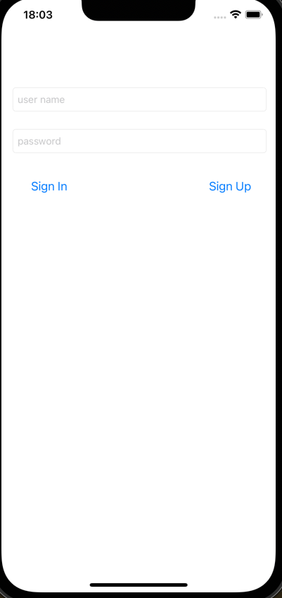
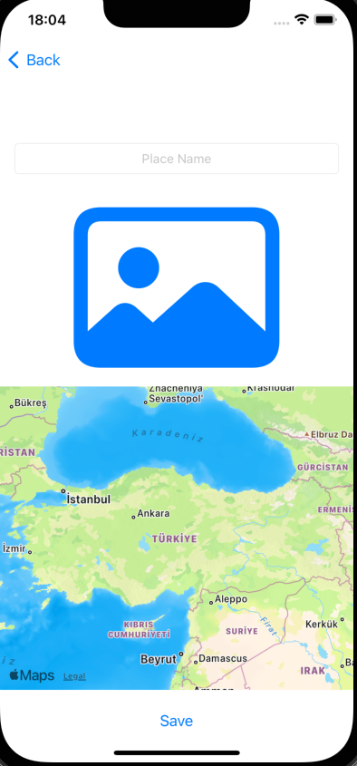
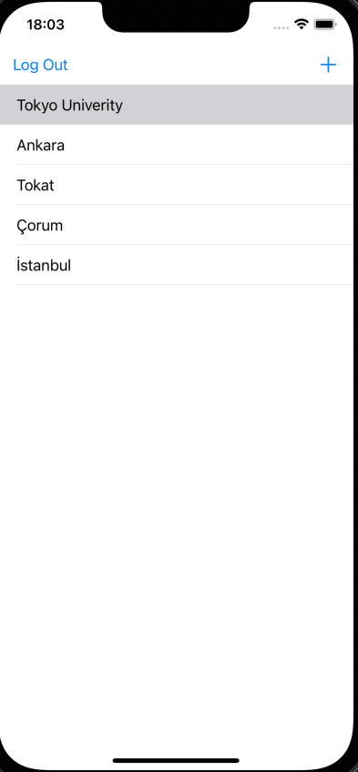
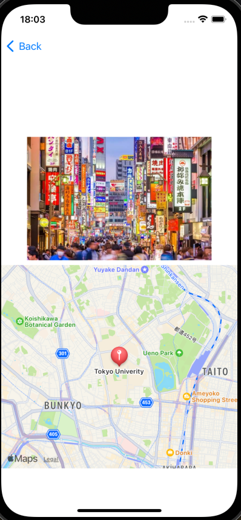

# FoursquareClone

The app is clone of Foursquare. 

## Parse

In this app I have used Parse. Using Parse, I implemented user authentication, registration, and login processes in this application. 
Additionally, I ensured that the images, comments, and like information of the posted content are stored on Parse.

# Back4app

I have use Back4app as a Parse database.

