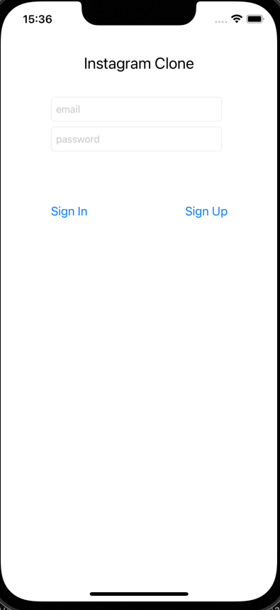
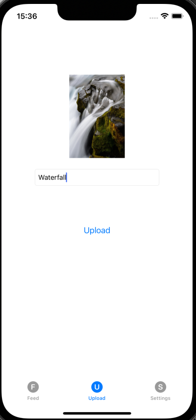
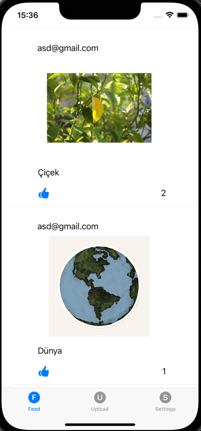

# Instagram Clone

The app is clone of instagram. 

## Firebase

In this app I have used firebase. Using Firebase, I implemented user authentication, registration, and login processes in this application. 
Additionally, I ensured that the images, comments, and like information of the posted content are stored on Firebase.

# SDWebImage

I have used SDWebImage as a async image downloader for images that are shown in posts.

  

